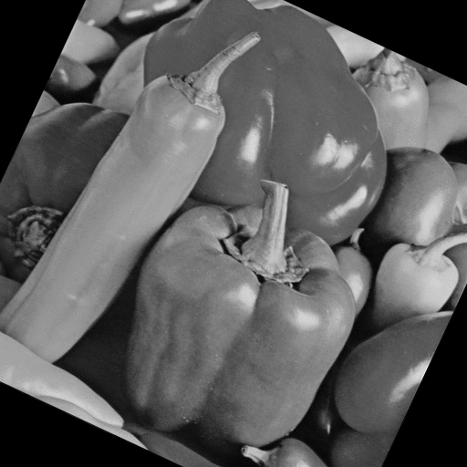
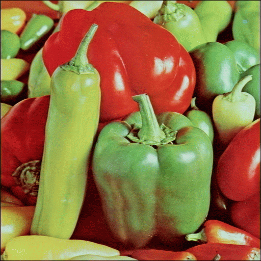

# TIMAG 2023 - PROYECTO FINAL  
# PROCESAMIENTO DE IMAGENES DE MORRONES

[Página web del proyecto](http://timag.pages.fing.edu.uy/pelican) (ingresar URL en **Settings --> Pages --> Access pages**. Puede aparecer luego del primer commit del repositorio) 

[Repositorio del proyecto](https://gitlab.fing.edu.uy/timag/pelican) 


Este es el repositorio del proyecto de procesamiento de imágenes de morrones.
Este proyecto utiliza el análisis de imágenes para aumentar la calidad de los morrones. 

Utilizando diversos algoritmos, se logra madurar los morrones haciendo que queden sanos y atractivos para el consumidor. 

En la figura se puede ver los morrones  antes y despues de procesar.

<figure>
  
  
  <figcaption>
  Izquierda: Antes de procesar, Derecha: Luego del procesamiento.
  </figcaption>
</figure>

Se utilizan las bases de datos ..... y ...... que pueden descargarse de 

```

```

En el directorio **data** pueden verse ejemplos de las imágenes de esas bases.

En la carpeta **src** se encuentra el código desarrollado en el proyecto.  
Los principales resultados pueden verse en el notebook:

```
```
Se tiene una breve guía de la creación de la página web en [_/page_conf/README.md_](./page_conf/README.md).