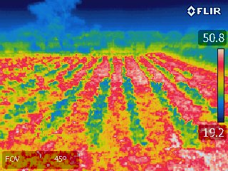
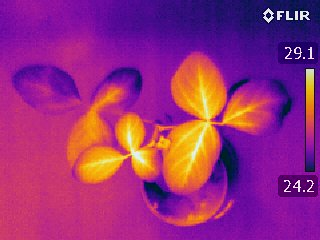

# TIMAG 2023 - PROYECTO FINAL  
# ANALISIS DE CULTIVOS MEDIANTE IMAGENES IR

[Página web del proyecto](http://juan.manuel.varela.pages.fing.edu.uy/proyecto-timag/)

[Repositorio del proyecto](https://gitlab.fing.edu.uy/juan.manuel.varela/proyecto-timag) 

Este es el repositorio del proyecto de análisis de cultivos mediante imágenes IR.
Este proyecto utiliza el análisis de imágenes infrarrojas para generar una lookup table (LUT) a partir de la cual se pueda relacionar el color de cada pixel con una temperatura en grados Celsius. 

Se procesan las imágenes para detectar su temperatura máxima y mínima y a partir de la barra de la derecha se crea la tabla. 

En la figura se puede ver los ejemplos de imágenes utilizadas.

<figure>
  
  
  <figcaption>
  Izquierda: Imagen tomada en campo, Derecha: Imagen tomada en laboratorio.
  </figcaption>
</figure>

Se utiliza una base de datos con imágenes tomadas en campo y en laboratorio.

En el directorio **data** pueden verse ejemplos de las imágenes de esta base.

En la carpeta **src** se encuentra el código desarrollado en el proyecto.  
Los principales resultados pueden verse en el notebook:
**proyecto_ir**