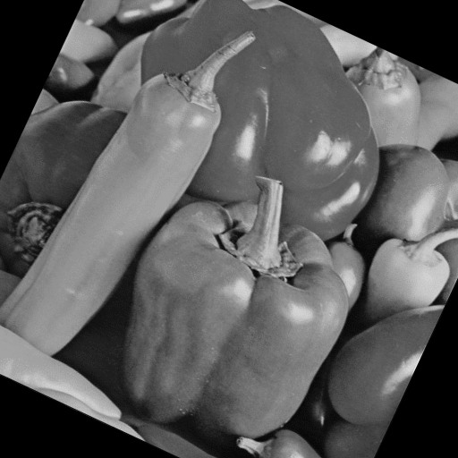
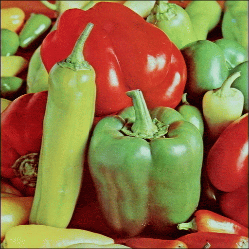

Title: Experimentos
Date: 2023-07-03
Category: Page
Ordinal: 004

Esta página muestra los experimentos realizados en el proyecto. Compartimos los detalles de los experimentos, los datos recogidos y los resultados obtenidos.

## Ejemplo de uso de figuras

https://docs.getpelican.com/en/latest/plugins.html

https://github.com/getpelican/pelican-plugins/tree/master/better_figures_and_images

https://duncanlock.net/blog/2013/05/29/better-figures-images-plugin-for-pelican/

https://github.com/getpelican/pelican-plugins.git

En la figura {#fig_morrones_grises} se puede ver los morrones antes del procesamiento y en la figura {#fig_morrones} luego del procesamiento de maduración.
En la figura {#fig_morrones_2} se puede ver antes y despues de procesar.

<figure>
  
  <figcaption>
  fig_morrones_grises :: La figura de morrones grises.
  </figcaption>
</figure>

<figure>
  
  <figcaption>
  fig_morrones :: La figura de morrones en color.
  </figcaption>
</figure>

<figure>
  
  
  <figcaption>
  fig_morrones_2 :: Izquierda: Antes de procesar, Derecha: Luego del procesamiento.
  </figcaption>
</figure>

