Title: Datasets
Date: 2023-07-23
Category: Page
Ordinal: 003

La base de imágenes utilizada en el proyecto consiste en 171 pares de imágenes de plantas capturadas tanto en campo como en laboratorio. Estos pares estan formados por una fotografía visible y una infrarroja. 
Las fotografías infrarrojas fueron tomadas por una cámara de marca FLIR, esta camara genera e imprime la escala de temperatura sobre la imagen pero no almacena metadatos con el archivo, por lo que para extraer esta información sería necesario utilizar un software de la empresa o hacer un análisis como el realizado en este proyecto.

En la Figura {#fig_ejemplo_dataset} se muestran ejemplos de pares de imágenes de la base.
<figure>
  

    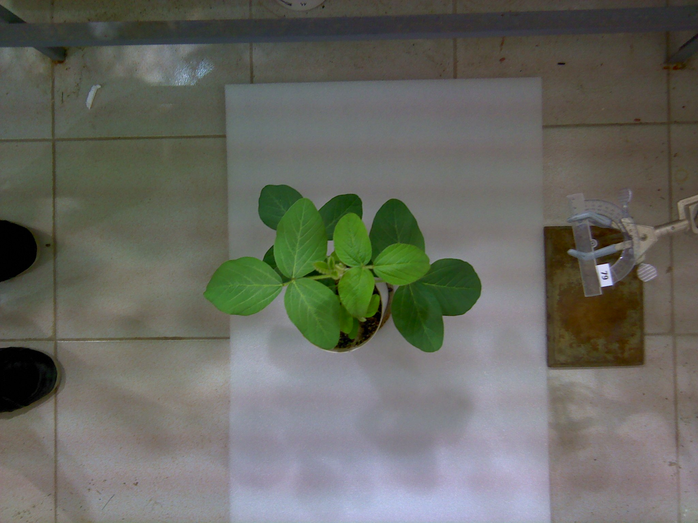
    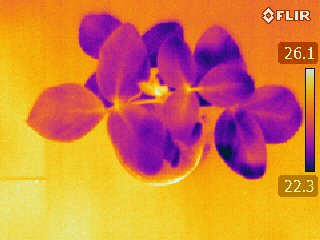
  

  

    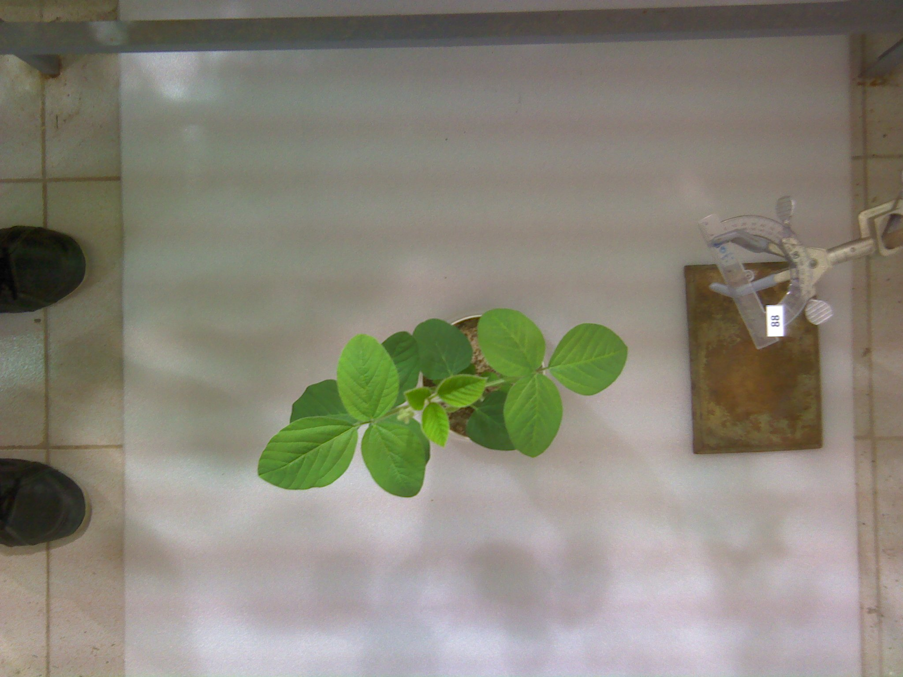
    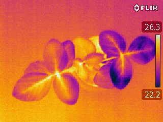
  

  

    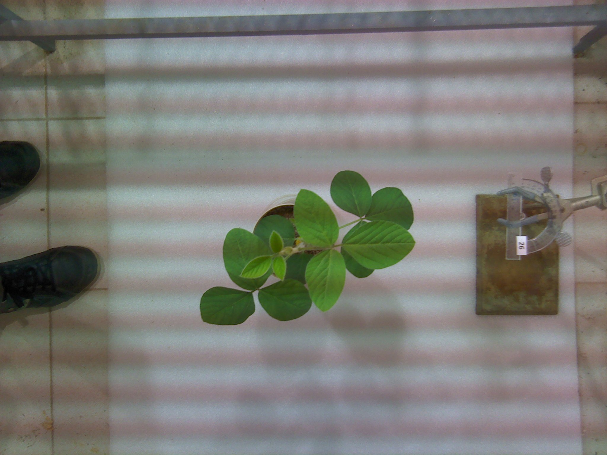
    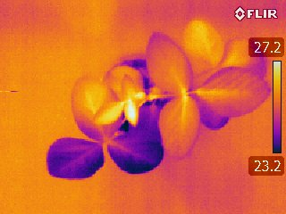
  

  

    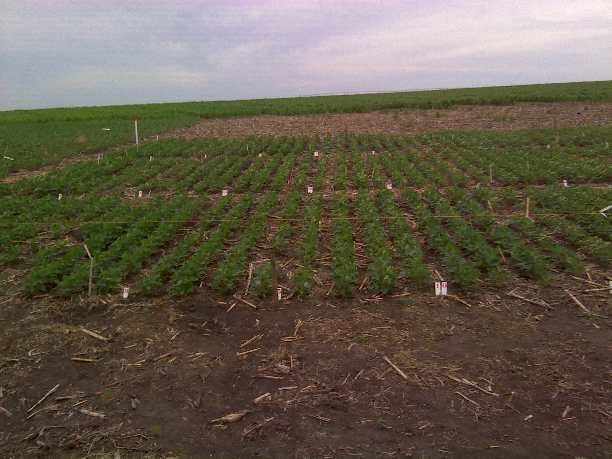
    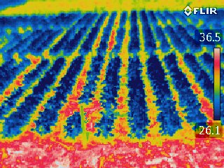
  

  

    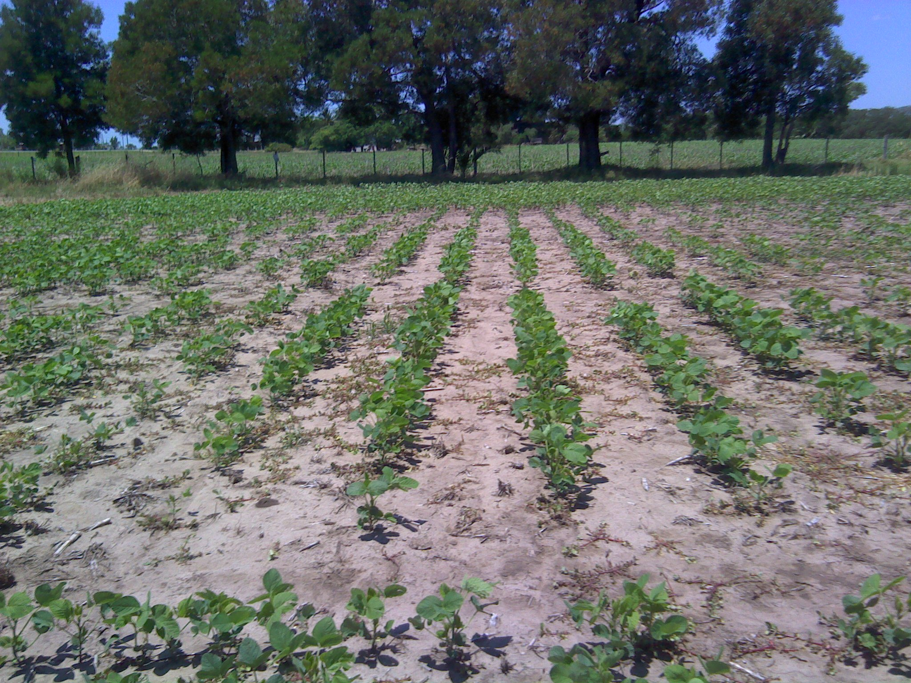
    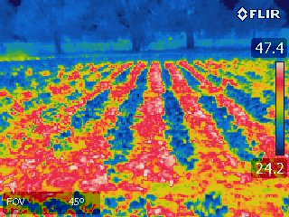
  

  

    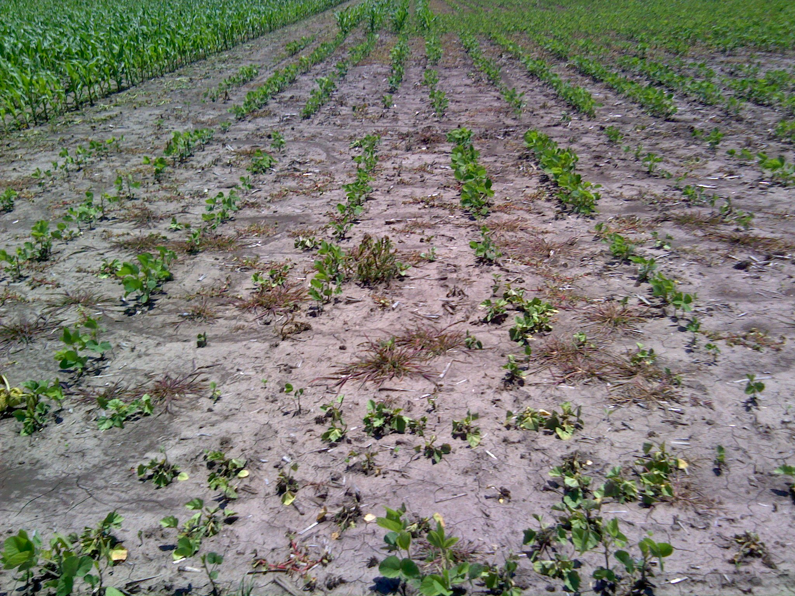
    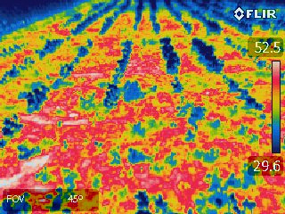
  

  <figcaption>
  fig_ejemplo_dataset :: Pares de imágenes de ejemplo.
  </figcaption>
</figure>

Si bien en este proyecto fueron analizadas únicamente las imágenes infrarrojas, el resto de las imágenes pueden ser útiles para trabajos posteriores.