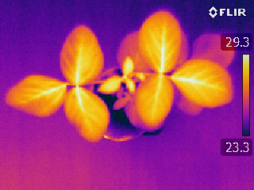
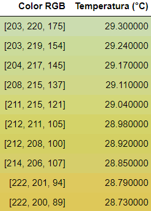
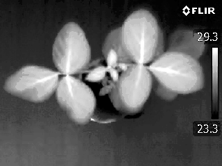
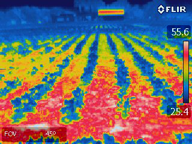
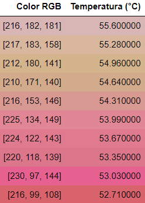
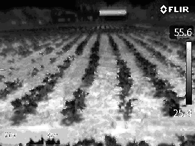
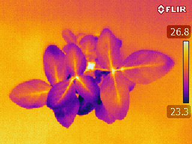
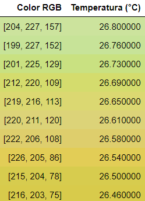
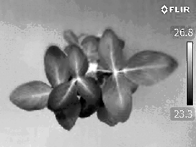

Title: Experimentos
Date: 2023-07-23
Category: Page
Ordinal: 004

Como un primer paso de cara a posibles análisis posteriores, luego de la generación de la LUT se procedió a utilizarla para asociar cada uno de los pixeles de la imagen a un valor de temperatura. Esto se realizó asignando a cada pixel el valor de temperatura del color más cercano presente en la tabla. De esta forma se obtuvo una matriz del tamaño de la imagen, cuyas entradas son la temperatura detectada en cada pixel.

Para permitir la visualización de este resultado, se escaló esta matriz para que tome valores enteros entre 0 y 255, convirtiendose en una imagen de niveles de gris en la que el blanco representa la temperatura más alta y el negro la más baja.

A continuación se muestra los resultados en distintas imágenes.

### IMAGEN 1

<figure>
  
  <figcaption>
  fig_imagen_resultado_1 :: Imagen 1.
  </figcaption>
</figure>

<figure>
  
  <figcaption>
  fig_tabla_resultado_1 :: Primeras 10 filas de la lookup table generada.
  </figcaption>
</figure> 

<figure>
  
  <figcaption>
  fig_imagen_resultado_1_grises :: Imagen 1 en niveles de gris.
  </figcaption>
</figure>

### IMAGEN 2

<figure>
  
  <figcaption>
  fig_imagen_resultado_2 :: Imagen 2.
  </figcaption>
</figure>

<figure>
  
  <figcaption>
  fig_tabla_resultado_2 :: Primeras 10 filas de la lookup table generada.
  </figcaption>
</figure> 

<figure>
  
  <figcaption>
  fig_imagen_resultado_2_grises :: Imagen 2 en niveles de gris.
  </figcaption>
</figure>

### IMAGEN 3

<figure>
  
  <figcaption>
  fig_imagen_resultado_3 :: Imagen 3.
  </figcaption>
</figure>

<figure>
  
  <figcaption>
  fig_tabla_resultado_3 :: Primeras 10 filas de la lookup table generada.
  </figcaption>
</figure> 

<figure>
  
  <figcaption>
  fig_imagen_resultado_3_grises :: Imagen 3 en niveles de gris.
  </figcaption>
</figure>

Se puede observar que en todos los casos, en la imagen de niveles de gris se identifican las mismas estructuras que en la imagen original, lo que es una buena señal de que el procesamiento es correcto.
