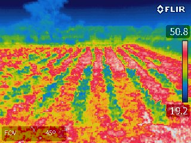
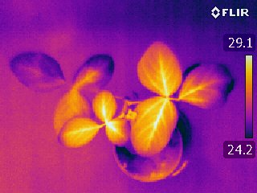
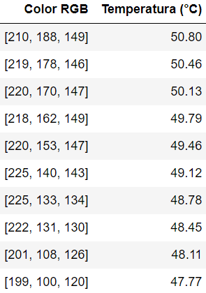

Title: Introducción
Date: 2023-07-03
Category: Page
Ordinal: 001


# PROYECTO - ANALISIS DE CULTIVOS MEDIANTE IMAGENES IR


El precio de los morrones en invierno es un tema complejo. Discriminar cuáles morrones están frescos y cuáles están pasados adquiere una importancia crucial para el consumidor en una economía de mercado fluctuante.El monitoreo de la temperatura de los cultivos proporciona información valiosa para los agricultores y los investigadores. Esta información es útil para diferentes aplicaciones como detección de estrés hídrico, evaluación de la salud de la planta, estimación de rendimiento y eficiencia en el uso de recursos.

Este proyecto utiliza el análisis de imágenes infrarrojas para generar una lookup table (LUT) para cada imagen, que permita asociar el color de cada pixel a un valor de temperatura en grados Celsius. Se trabaja con imágenes tomadas en campo y laboratorio como las de la Figura {#fig_ejemplo_IR}.

<figure>
  
  
  <figcaption>
  fig_ejemplo_IR :: Imágenes infrarrojas de ejemplo.
  </figcaption>
</figure>

Utilizando template matching, se identifica la temperatura máxima y mínima presente en la imagen, a partir de las cuales se genera la LUT utilizando como referencia la escala presente a la derecha. El algoritmo fue programado en Python. 

``` python
def lut_temperatura(img, base_digitos):
    pass
    pass
    pass

    return img_madurada

```

En la figura {#fig_lut_1} se puede ver un ejemplo de la tabla generada, donde se muestran las primeras 10 filas.

<figure>
  
  <figcaption>
  fig_lut_1 :: Primeras 10 filas de LUT generada a partir de la imágen en campo.
  </figcaption>
</figure>

