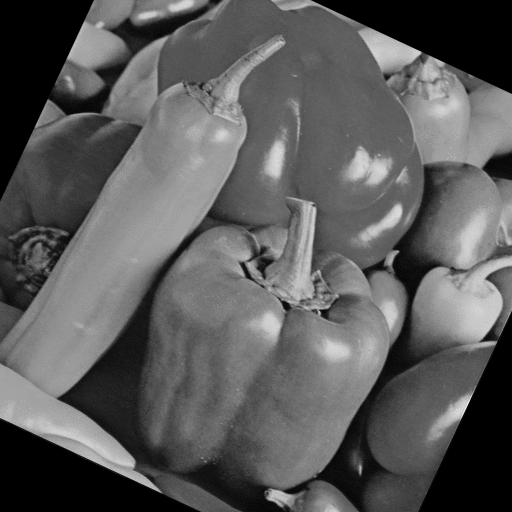

Title: Introducción
Date: 2023-07-03
Category: Page
Ordinal: 001


# PROYECTO - PROCESAMIENTO DE IMAGENES DE MORRONES


El precio de los morrones en invierno es un tema complejo. Discriminar cuáles morrones están frescos y cuáles están pasados adquiere una importancia crucial para el consumidor en una economía de mercado fluctuante.

Este proyecto utiliza el análisis de imágenes para aumentar la calidad de los morrones. Se trabaja con imágenes como la de la Figura {#fig_morrones_grises}.

<figure>
  <!--Incluir camino a la imagen a mostrar-->
  
  <figcaption>
  fig_morrones_grises :: La figura de morrones grises.
  </figcaption>
</figure>


Utilizando el algoritmo de Farmer et al. [@fa2021] se logra madurar los morrones haciendo que queden sanos y atractivos para el consumidor. El algoritmo fue programado en Python. 

``` python
def madurar(img, param1, param2):
    pass
    pass
    pass

    return img_madurada

```

En la figura {#fig_morrones_2} se puede ver los morrones  antes y despues de procesar.

<figure>
  
  
  <figcaption>
  fig_morrones_2 :: Izquierda: Antes de procesar, Derecha: Luego del procesamiento.
  </figcaption>
</figure>

