Title: Procedimiento
Date: 2023-07-23
Category: Page
Ordinal: 002

Se describirá el procedimiento paso a paso aplicado a la imagen de la Figura {#fig_imagen_procedimiento}.

<figure>
  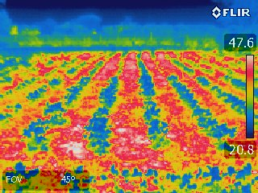
  <figcaption>
  fig_imagen_procedimiento :: Imagen a analizar.
  </figcaption>
</figure> 


# TEMPLATE MATCHING

Para identificar la temperatura máxima y mínima detectada en la imagen a partir de los números mostrados a la derecha, se utiliza la técnica de template matching.

Como primer paso, se reconoció que los números tienen la misma fuente en todas las imágenes, por lo que se generó manualmente una base de 10 imágenes, una correspondiente a cada dígito posible. Para generar esta base se obtuvo cada dígito recortandolo de alguna imagen donde estuviera presente, se paso a escala de grises promediando los tres canales y se umbralizó de forma tal que todos los pixeles que pertenecieran al dígito tengan valor 0 y el resto 255. En la Figura {#fig_base_digitos} se puede observar la base de dígitos completa.

<figure>
  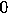
  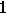
  
  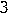
  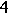
  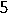
  
  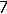
  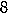
  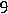
  <figcaption>
  fig_base_digitos :: Base de imágenes con dígitos del 0 al 9.
  </figcaption>
</figure> 

Posteriormente se pudo ver que todas las imágenes tienen la etiqueta de temperatura máxima y mínima en la misma posición, y que estos números se componen de dos dígitos seguidos por un punto, que oficia de separador decimal, y otro dígito al final.

Por esto, para facilitar el proceso de matching, se recortan 6 ventanas que contengan por completo cada uno de los dígitos. Además se pasan estas imágenes a escala de grises y se umbralizan al igual que se hizo con las imágenes de la base. Esto se realiza para normalizar los dígitos de forma tal que la correlación sea mayor durante el matching, evitando los posibles efectos negativos de la transparencia de la etiqueta. En la figura {#fig_digitos_imagenes} se puede ver las 6 imágenes resultantes.

<figure>
  <p float="left">
    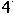
    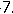
    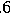
  </p>
  <p float="left">
    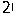
    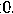
    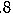
  </p>
  <figcaption>
  fig_base_digitos :: Recortes de dígitos de la imagen.
  </figcaption>
</figure>

Luego, se utiliza la siguiente función sobre cada una de las 6 imágenes para identificar el dígito correspondiente.

``` python
def match_digit(img):
    puntajes = {}

    for i, img_base in imagenes_base.items():
        
        resultado = cv2.matchTemplate(img.astype('uint8'), img_base, cv2.TM_CCOEFF_NORMED)
        _, puntaje, _, _ = cv2.minMaxLoc(resultado)
        puntajes[i] = puntaje
    
    return max(puntajes, key=puntajes.get)

```
Esta función toma la imagen recortada y la recorre con una de las imágenes de la base calculando un coeficiente de correlación para cada posición, luego se queda con el máximo valor y le asigna ese "puntaje" al digito correspondiente. Repite este proceso para todas las imágenes de la base, seleccionando finalmente el dígito con mayor "puntaje".

Al aplicar esta funcion sobre las imágenes recortadas, la misma devuelve "4", "7", "6", "2", "0" y "8" respectivamente.

# RECOMPOSICIÓN DE TEMPERATURAS

Para tener el valor de temperatura máxima y mínima se recomponen los valores a partir de los dígitos hallados, para esto se unen los tres primeros dígitos, colocando un punto antes del tercero, este valor corresponde a la temperatura máxima. Se realiza lo mismo con los últimos tres dígitos, que corresponden a la temperatura mínima.

# GENERACIÓN DE LOOKUP TABLE

Para generar la LUT a partir de estos valores se extrae un perfil vertical por el medio de la barra que indica la escala de colores. De esta forma se obtiene una lista de 95 colores RGB, en la que el primero corresponde a la temperatura máxima y el úlimo a la mínima. Para hallar los valores intermedios se calcula el cambio de temperatura que supone pasar de un pixel a otro con la ecuación $\Delta T= \frac{T_{max}-T_{min}}{\#saltos}$, en este caso $\Delta T=0.285^{\circ}C$. Con este valor, partiendo de la temperatura máxima se genera una lista de 95 temperaturas que llega hasta la mínima.

Finalmente se genera la tabla donde cada fila es un par Color RGB-Temperatura en °C. En la Figura {#fig_tabla_procedimiento} se puede ver las primeras 10 filas de la LUT resultante, en la cual, para generar una visualización más informativa se pintó el fondo de cada fila con el color RGB correspondiente.

<figure>
  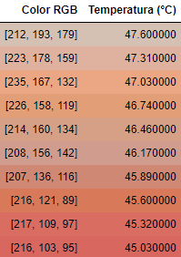
  <figcaption>
  fig_tabla_procedimiento :: Primeras 10 filas de la lookup table generada.
  </figcaption>
</figure> 